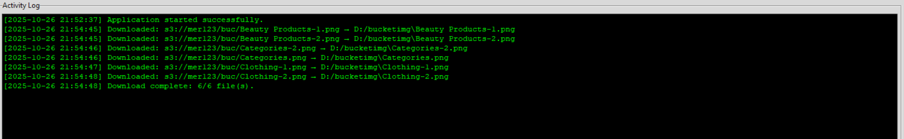

# ☁️ Cloud File Manager (Local ↔ AWS S3)

A **Python GUI-based file manager** that allows you to browse, upload, download, and manage files between your **local machine** and **Amazon S3 bucket** — all through an elegant **Tkinter interface**.

---

## 🖼️ GUI Snapshots

### 🏠 Main Application Window
.png)

> Dual-pane file explorer: Local filesystem on the left, AWS S3 bucket on the right.

---

### ⬆️ Uploading Files to S3
.png)

> Upload multiple files with live progress tracking and logs.

---

### ⬇️ Downloading Files from S3
.png)

> Download files or entire folders to your local system.

---

### 🗂️ Activity Log Console


> Real-time log messages for each operation, with timestamps and status feedback.

---

## ✨ Features

| Feature | Description |
|----------|--------------|
| 🌍 **Dual-pane Interface** | Browse local directories and S3 buckets side-by-side |
| ☁️ **AWS S3 Integration** | Upload, download, delete, and create folders directly in your S3 bucket |
| ⚙️ **Progress Tracking** | Visual progress bar for long-running uploads/downloads |
| 🧵 **Threaded Operations** | Background threads prevent GUI freezing during S3 operations |
| 🧾 **Activity Logger** | Real-time console logs in the GUI + persistent log file (`logs.txt`) |
| 📁 **Dynamic TreeView** | Expand and collapse folders dynamically for both local and S3 trees |
| 🔗 **View Object URLs** | Instantly open public URLs for S3 files in your web browser |
| 🛡️ **Error Handling** | Graceful error messages and recovery for AWS or permission issues |

---

## 🧰 Tech Stack

- **Language:** Python 3.10+
- **GUI Framework:** Tkinter
- **Cloud SDK:** boto3 (AWS S3)
- **Threading:** Python `threading` module
- **Logging:** Custom logger with timestamp and GUI integration

---

## 🚀 Setup Instructions

### 1️⃣ Clone the Repository
```bash
git clone https://github.com/Abhix126/Cloud_File_Manager.git
cd Cloud_File_Manager

